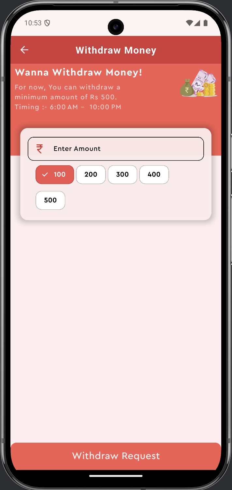
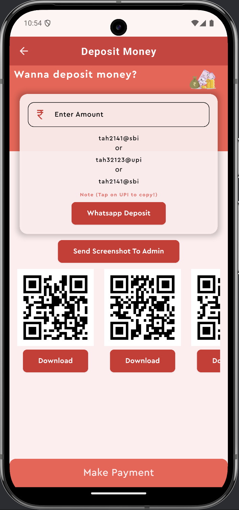

## 📖 Project Overview

This is a **full-stack online betting application** built with **Flutter** for frontend and **Node.js/Express** for backend, deployed on **Render**.  
Users can browse betting options, place bets, receive notifications, and manage their wallet.

---

## 🛠 Features

- User authentication (Sign Up / Login)  
- Browse available games and betting options  
- Place bets with wallet balance  
- Admin dashboard for managing offers and notifications  
- Push notifications  
- REST API backend with secure endpoints  

---

## 📈 Tech Stack

- **Frontend:** Flutter  
- **Backend:** Node.js + Express  
- **Database:** MongoDB (Atlas)  
- **Hosting:** Render (Backend), Flutter Build (iOS/Android)  

---

## 🖼 App Screenshots

Here are some key screens from the app:

  <figure style="display:inline-block; margin:10px;">
    
    <figcaption>Dashboard</figcaption>
  </figure>
  <figure style="display:inline-block; margin:10px;">
    
    <figcaption>Cash Withdraw</figcaption>
  </figure>
  <figure style="display:inline-block; margin:10px;">
    
    <figcaption>Cash Deposit</figcaption>
  </figure>
  <figure style="display:inline-block; margin:10px;">
    
    <figcaption>Pick Number</figcaption>
  </figure>

  🚀 <a href="https://betting-backend-1-imvm.onrender.com">Click here to Access / Download the App</a>

